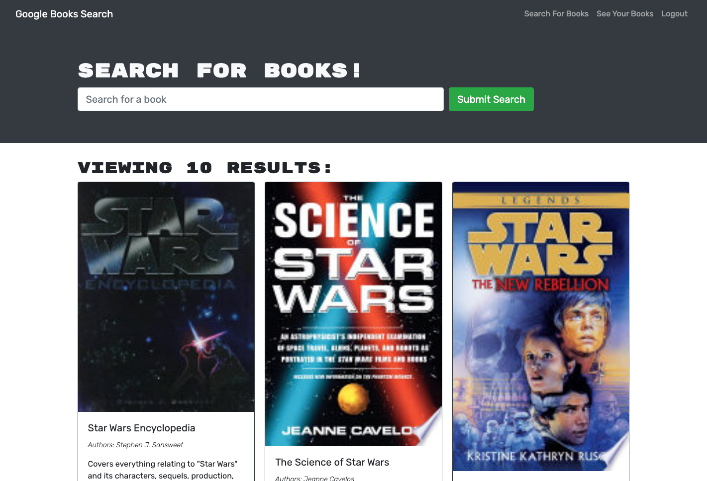
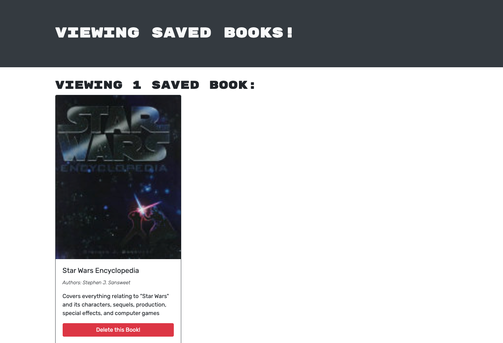

# Book-Search-Engine

## Description
This is a MERN stack application that allows users to search for books and save them to their profile. The application uses the Google Books API to search for books and the Apollo Server to save books to the user's profile. The application uses GraphQL to query and mutate data, and is deployed using Heroku and MongoDB Atlas.

## Screenshot

 

## Link To Deployed Application
[Deployed Site](https://afternoon-shore-57278.herokuapp.com/)